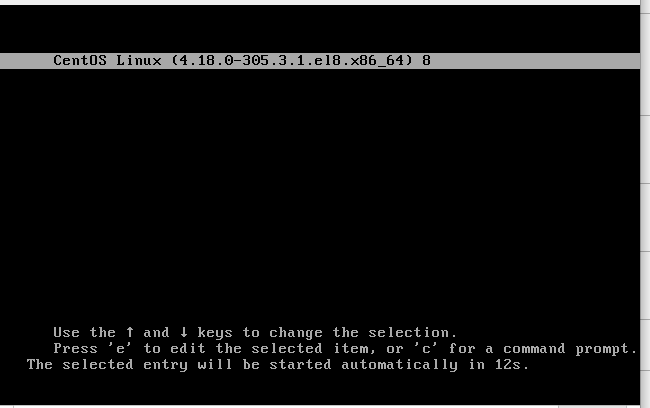
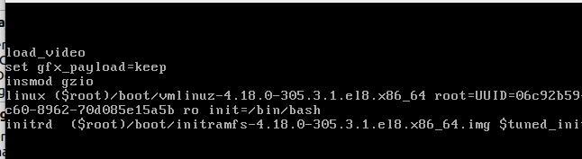
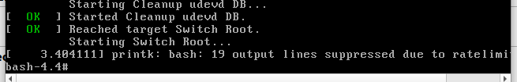
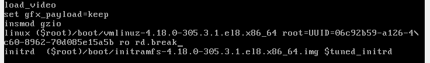
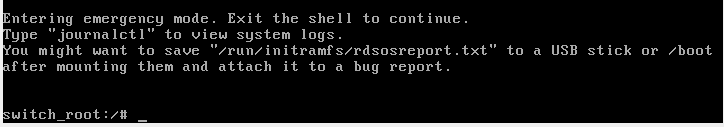
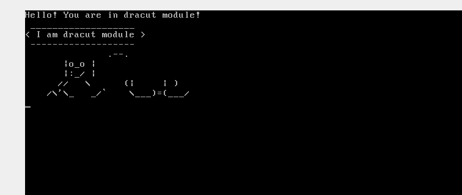

# Работа с загрузчиком


## Задание
1. Попасть в систему без пароля несколькими способами.
2. Установить систему с LVM, после чего переименовать VG.
3. Добавить модуль в initrd.

---
 ### 1. Попасть в систему без пароля несколькими способами.
   
<details><summary>Способ 1</summary>   

1. Вмешиваемся в процесс загрузки - нажимем  клавишу "e"

2. Правим конфиг загрузки - добавляем init=/bin/bash после ro

3. Попадаем в систему с монтированными дисками 


4. Монтируем корень системы 
```sh
mount -o remount,rw /  
```
5. Меняем расположение корня монтирования системы
```sh
chroot /    
```
6. Заменим пароль root
```sh
passwd root   
```
7. Создадим маркерный файл для перечитки конфигурации
```sh
touch .autorelabel    
```

8.  Перезагрузка
```sh
reboot
```
</details>
<details><summary>Способ 2</summary>   

1. Добавляем прерыватель в загрузку

```sh
rd.break
```



2. Продолжаем загрузку



3. Монтируем нашу систему в sysroot
```sh
mount -o remount,rw /sysroot 
```
4. Делаем sysroot корнем нашей системы
```sh
chroot /sysroot
```
5. Меняем пароль root
```sh
passwd root 
```
6. Ставим флаг перерасчета системы
```sh
touch /.autorelabel  
```

7. Перезагружаемся
 </details>

 ### 2. Установить систему с LVM, после чего переименовать VG.
 <details> <summary>Решение</summary>
 1. Проверяем, что наша система на lvm
 ```sh
vgs 
 ```

```sh
  VG         #PV #LV #SN Attr   VSize   VFree
  VolGroup00   1   2   0 wz--n- <38.97g    0 
```

 2. Переименовываем
 ```sh
vgrename VolGroup00 OtusVg
 ```
3. Меняем в файлах кофигураций grub  и fstab на новое имя

```sh
sed -i 's/VolGroup00/OtusVg/g' /etc/default/grub && sed -i 's/VolGroup00/OtusVg/g' /boot/grub2/grub.cfg && sed -i 's/VolGroup00/OtusVg/g' /etc/fstab

```

4. Перегенерируем загрузчик
```sh
mkinitrd -f -v /boot/initramfs-$(uname -r).img $(uname -r)
```
5. Перегружаемся
6. Проверяем
```sh
  VG     #PV #LV #SN Attr   VSize   VFree
  OtusVg   1   2   0 wz--n- <38.97g    0 
```  
 </details>

 ### 3. Добавить модуль в initrd.
<details> <summary>Решение</summary>

1. Создаем директорию модуля
```sh
mkdir -p /usr/lib/dracut/modules.d/05test
```
2. Создаем файл с функциями модуля /05test/module-setup.sh
```sh
#!/bin/bash

check() {
    return 0
}

depends() {
    return 0
}

install() {
    inst_hook cleanup 00 "\${moddir}/test.sh"
}
```

выставляем права на исполнение
```sh
chmod +x /usr/lib/dracut/modules.d/05test/module-setup.sh
```

3. Создаем файл с логикой модуля 05test/test.sh

```sh
#!/bin/bash

exec 0<>/dev/console 1<>/dev/console 2<>/dev/console
cat <<'msgend'
Hello! You are in dracut module!
 ___________________
< I am dracut module >
 -------------------
   \
    \
        .--.
       |o_o |
       |:_/ |
      //   \ \
     (|     | )
    /\'\_   _/\`\
    \\___)=(___/
msgend
sleep 10
echo " continuing...."
```

Даем права на исполнение
```sh
chmod +x /usr/lib/dracut/modules.d/05test/test.sh
```

4. Перегенерируем загрузчик
```sh
mkinitrd -f -v /boot/initramfs-$(uname -r).img $(uname -r)
```

5. Проверим что модуль собрался
```sh
lsinitrd -m /boot/initramfs-$(uname -r).img | grep test
```

 
  </details>