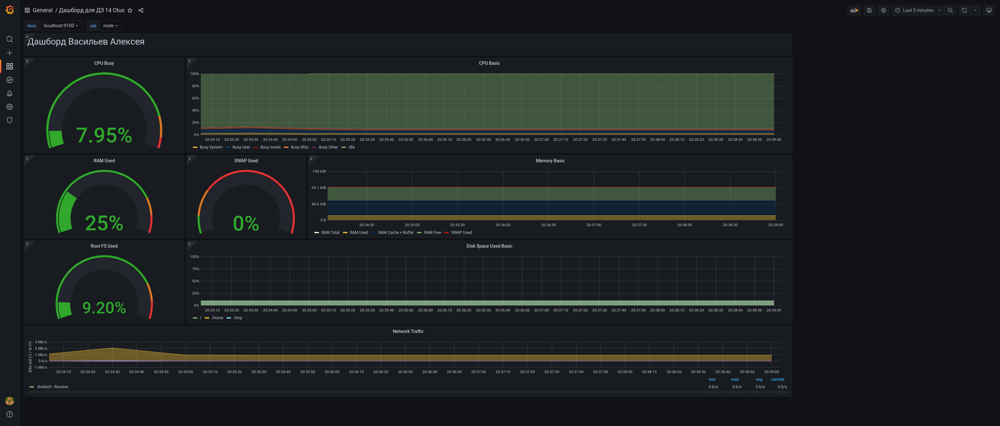

# Настройка мониторинга

## Описание/Пошаговая инструкция выполнения домашнего задания:

Настроить дашборд с 4-мя графиками
 *  память;
 *  процессор;
 *  диск;
 *  сеть.
  
Настроить на одной из систем:
  *  zabbix (использовать screen (комплексный экран);
  *  prometheus - grafana.
  *  использование систем, примеры которых не рассматривались на занятии.

 Список возможных систем был приведен в презентации.  
 В качестве результата прислать скриншот экрана - дашборд должен содержать в названии имя приславшего.


---
## Решение
1. Создаем конфигурацию мониторинга на основе docker
   * Nodeexporer
   * Prometheus
   * Garafana
  
Получившийся  [docker-compose](docker-compose.yaml)

2. [Создаем свой Dashboard](./grafana/dashboards/my-custom.json)  


3. Как запустить
   ```sh
   cd 14_monitoring
   docker-compoose up -d
   ```
4. Переходы для инструмнтов
 * [Grafana](http://localhost:3000) 
 * [NodeExporter](http://localhost:9100) 
 * [Prometheus](http://localhost:9090) 

---
Результат

